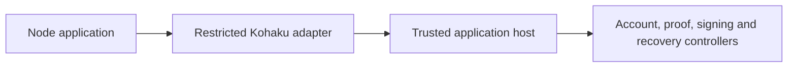

# Restricted Railgun Node prototype — October 6, 2026

A standalone Node prototype now packages the restricted Kohaku snapshot and private-operation adapters without importing Freedom's wallet engine, proof runtime, account owners, storage or RPC clients. It can be consumed by an independent application that supplies a trusted host. It is an unpublished prototype, not a production SDK release or a generic Kohaku Host implementation.

The source checkpoint is `f84da57a8ef9234d63447774c240ce4dfeb92f6b`. The [audit archive](https://github.com/solardev-xyz/railgun-kohaku-adapter/blob/377c2a5d1aca18f0ed328dfdda955bd7d1ba271c/docs/freedom-qualification/railgun-kohaku-node-prototype-2026-10-06/README.md) preserves the reviewed artifact and verification evidence, distinguishing exact payloads from explicitly normalized publication copies. An exact local package is retained under `tmp/privacy-build/railgun-kohaku-node-prototype-oct6`; that ignored build directory is not a checked-in package or an npm publication.

This is the historical three-factory artifact. The [later five-factory prototype](railgun-kohaku-public-node-prototype-2026-10-06.md) adds public Shield preparation/submission and the private Promise-observation correction. Its evidence and local artifact have separate locations; nothing below is relabeled as a run of the newer source.

## What an application receives

The package exports three factories: `createRailgunKohakuSnapshotPlugin`, `createRailgunKohakuPrivateAdapter`, and `createRailgunKohakuPrivateAdapterBroadcaster`. The snapshot factory accepts a host-supplied snapshot host. The private adapter accepts a transaction-capable host with explicit lifecycle and preparation/broadcast methods. Public Shield/deposit submission remains in the existing Freedom integration and is not exported by this package.

Freedom supplies its own fixed adopting host, independently qualified by the [five-case native campaign](railgun-kohaku-private-adapter-2026-10-06.md). That host is excluded from the standalone package. A third-party host must enforce its own ownership, selected-input, recipient, proof, disclosure-review and durable spending policy. Structural interfaces and host-provided snapshots do not confer Freedom authority. The portable adapter validates recipient syntax; it does not establish that a recipient belongs to the user.

The packaged result contract fixes Sepolia/direct submission and bounds requested amounts at 10^16 base units. The fixed Freedom host additionally enforces genuine WETH binding, self-recipient/change policy and the entire selected-input ceiling, including partial withdrawals. Independent hosts must enforce their asset and selected-input policies; accepting a structurally valid ERC-20 input does not authorize it. Acknowledged sender/recipient fields require prefixed 20-byte hex; mixed-case strings are checksum-validated. Valid result identity and original address spelling are preserved. Malformed acknowledgement addresses with one canonical transaction hash become uncertain results, never permission to retry.

## Package boundaries

CommonJS and ESM entrypoints share one canonical CommonJS runtime and the same operation identity registries. The canonical declaration owns one type-only operation brand; the ESM declaration forwards to it. Legitimate operations cross the two entrypoints. Copied/replayed operations and operations from another physical package copy refuse. Separate physical copies must not share a host: module-local identity cannot enforce global ownership across copies, cache eviction, VM realms or processes.

The runtime is 52,477 bytes, SHA-256 `61add3033264bb4f2e1a1a402bc861a7cff1f173f8de1df1ea909e1b0fe85f39`. Its only runtime imports are `assert/strict` and `util`. An explicit importer-specific build bridge maps the adapter's ethers import to the public `ethers/address` subpath. The emitted graph contains checksum utilities, not providers or network clients. This is a build transformation, not a claim that the original CommonJS ethers namespace is narrow.

The build records 62 parsed inputs, 20 emitted contributors and 81 file inputs. Runtime dependency licenses cover ethers 6.17.0 and its nested noble/hashes 1.3.2. Parsed-but-eliminated noble/curves 1.2.0 and build-tool licenses are recorded separately. Covered Freedom source, full MPL-2.0 license, active declaration inputs and build/combination recipes accompany the artifact. No dependency was installed or upgraded. No upstream Kohaku source or declaration payload is redistributed; its pinned source graph is an external qualification input.

## Verification

| Evidence                   | Completed checks                                                                                   | What it establishes                                                                                                                           |
| -------------------------- | -------------------------------------------------------------------------------------------------- | --------------------------------------------------------------------------------------------------------------------------------------------- |
| Corrected runtime build    | Two identical 20-file artifacts, build reports and metafiles                                       | Reproducibility on the pinned Node 24.18.1 / Darwin arm64 / esbuild 0.28.2 toolchain                                                          |
| Expanded runtime consumers | CJS 33, ESM 33 and mixed 34 case executions; seven distinguishing failure controls                 | Emitted address checks, outcome identity, held-work drainage, malformed host boundaries and cross-copy refusal                                |
| Portable declarations      | Three positive and 34 negative NodeNext programs                                                   | Bare-package CJS/ESM resolution and the restricted consumer contract                                                                          |
| Actual Kohaku graph        | One positive and six negative programs against revision `6fdc248b3d28942d9aaa35c49c1ac76dab89dc0e` | Specialized PluginInstance and result-bearing Broadcaster compatibility; generic Host/factory and default-void broadcaster remain unsupported |
| Final combined artifact    | Two identical 30-file assemblies; fresh CJS/ESM/mixed runtime and type consumers                   | The exact final manifest, corrected runtime and declarations work together                                                                    |

Final runtime consumers include 30 address-case executions across three processes, ordinary snapshot/private lifecycle smoke and mixed-entrypoint identity checks. All healthy original commands naturally exited 0. Held work uses bounded cleanup; no force-exit success is claimed. Three sticky trap controls and four detached runtime mutants each failed for the intended reason. The traps instrument selected network/process/root-import APIs; they are not an OS sandbox for arbitrary host callbacks.

Strict TypeScript 6.0.3 checks use noEmit and skipLibCheck false. Portable consumers use NodeNext with standard ES2022+DOM libraries, no aliases/custom resolution or repository compiler reads. The separate actual-upstream bridge uses ESNext/Bundler and real pinned source dependencies; installed ox differs from the upstream provider range, so it is not an upstream lockfile build. These checks validate declarations and consumers, not the JavaScript implementation. Final consumers reuse unchanged declaration evidence rather than relabeling historical negative runs as fresh.

The five declaration mutation controls distinguish missing declaration files, duplicate brands, void outcomes and a misrouted ESM type entry. The last still compiles; the explicit expected-resolution-graph check detects it. Typed token spreads can compile but fail runtime identity admission. Concrete tail-call callbacks are unsupported; `tailCalls: undefined` and widened upstream method types retain their documented static/runtime caveats.

## Remaining work

This completes a restricted standalone Node prototype. A reusable public Shield host/adapter, a separately reviewed recovery companion, broader platform/compiler support, independent host implementations and release packaging remain further work. Real service eligibility and live private spending need their specific disclosure/transaction approval; neither this package nor synthetic native qualification supplies it. UI/product design remains a separate joint phase.

Historical artifacts and failed qualification attempts are retained with their original source scope. Documentation copies with normalized machine paths are audit evidence, not byte-identical replacements for the runnable prototype or a claim of a portable build recipe on every platform.
