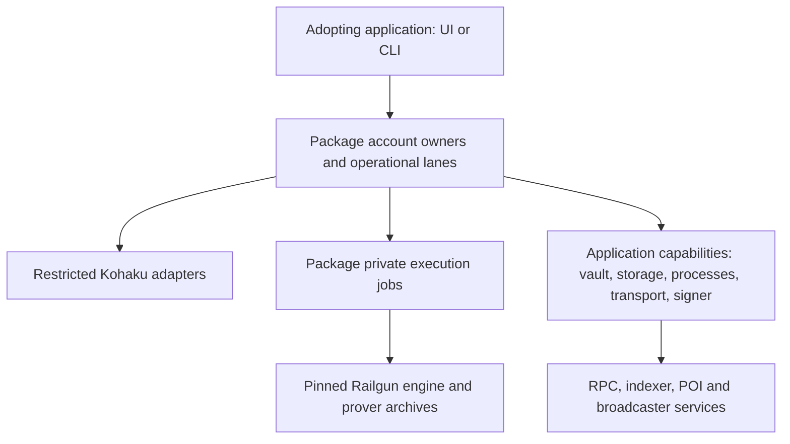

# Architecture and adoption boundary

The package has a small Kohaku-facing API and a larger wallet integration API.
They serve different callers. Using the former does not automatically implement
the latter.

This is a responsibility diagram, not a complete call graph. The package
authenticates supplied runtime archives and circuit artifacts; it does not
download or start services at import time. In-process host callbacks are trusted
capabilities, not a sandbox.

## Responsibilities

| Layer | Owns | Supplied by the adopter |
| --- | --- | --- |
| Root adapters | Restricted read/prepare/submit shapes, copying, lifecycle and one-use operation identity | Authoritative host operations; the owner entry is one way to provide them |
| Account owners (`/host/owner`) | Enrollment, public/wallet/TXID coordination, note ownership, account lanes, retained operations and POI recovery | Genuine host capabilities and authenticated runtime locations |
| Private execution kernel | Fixed job purposes, guarded bootstrap, runtime/artifact checks and proof execution | Process/channel launch, termination and observed closure |
| Host application | User/profile identity, vault lifetime, fixed credential derivation, context ownership, storage facilities, network routing, EOA signing/journal integration and reviews | The application implements these and tests their authority boundaries |
| Upstream runtime and services | Railgun engine/prover algorithms, circuit artifacts and deployed chain/service behavior | Reviewed compatible inputs and configured service access |

The master seed stays in the application's vault boundary. The package obtains
limited credential loans under the [credential contract](../owners/CREDENTIAL-HOST-CONTRACT.md).
Replacing those loans with fixture bytes proves no real ownership boundary.

## Public integration surfaces

- Root: five restricted Kohaku factories. Their types are structurally checked
  against the recorded upstream plugin version; generic `Host` and
  `CreatePluginFn` integration is not claimed.
- `/host/owner`: `initializeRailgunMain({host, runtime})`, returning account
  creation/opening. Initialize once per main realm using one physical package.
- `/host/owner-worker-bootstrap` and `/host/bootstrap`: fixed worker and utility
  entry support. They are not a caller-selectable module execution API.
- `/data` and `/read`: bounded capsule reading and read projections with their
  documented limits. They do not authenticate ownership or grant spending power.
- Other `/host/*` entries: trusted composition/data/authority helpers, documented
  in the root README and declarations. They are not renderer-facing services.

Use the package exports rather than importing `src/**`. A second physical package
copy has separate authority registries. Serializable records, matching method
names and TypeScript assignability cannot substitute for genuine host ownership.

## Current portability limits

The production host boundary is captured as exact capability families. Several
declarations intentionally leave registry-specific functions opaque; a complete
standalone host cannot be inferred from their TypeScript shapes alone. The
[owner contract](../owners/INTEGRATION.md) and source usages remain necessary.

Existing native evidence uses Electron utilities and workers. Node can load the
restricted adapters and main initializer, but that alone does not qualify a
Node-only execution host. The reference app must select and qualify an actual
process implementation before claiming portability.

The deployed chain, supported operations, amount limits, service policy and
circuit artifacts are currently pinned narrowly. Source identity also binds
derived generations to broad package/host inputs. These are explicit areas of
the [adoption plan](../ADOPTION-ROADMAP.md), not configuration switches a consumer
can safely bypass.

## Persistent state and upgrades

Derived public and wallet caches can be rebuilt under a compatible policy.
Retained signatures, attempted submissions, reservations and proof history cannot
be treated as disposable caches. Current source-policy changes may force a full
rebuild; that is a known availability problem.

The live campaign's fixed continuation ledgers are qualification tooling. A
reference wallet must expose its own understandable operation lifecycle and
recovery commands. It must not require developers to reproduce the historical
journey-number sequence to use the package.
